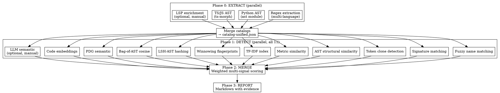

# Deduplicating Functions — Multi-Signal Detection

## Overview

LLM-generated codebases accumulate semantic duplicates: functions that serve the same purpose but were implemented independently. This skill uses defense-in-depth multi-signal detection across all four standard clone types, combining classical analysis (AST, tokens, metrics, signatures, fuzzy matching) with optional manual LLM semantic follow-up.

A pair flagged by 3+ independent strategies gets HIGH confidence automatically — the agreement IS the evidence.

## Clone Type Coverage

| Type | Description | Detection Strategies |
|------|-------------|---------------------|
| Type 1 | Exact clones (whitespace/comment diffs) | Token hashing |
| Type 2 | Renamed clones (different identifiers) | Normalized AST fingerprint, token normalization |
| Type 3 | Near-miss clones (statements added/removed) | AST n-gram similarity, metric comparison |
| Type 4 | Semantic clones (different implementation) | LLM semantic analysis, fuzzy names + signatures |

## Prerequisites

```bash
pip3 install -r requirements.txt  # rapidfuzz, datasketch
npm install                        # ts-morph (for TypeScript AST extraction)
```

Python AST extraction requires Python 3.10+. TypeScript AST extraction requires Node 18+.

## Quick Reference

### Automated Pipeline (Recommended)

```bash
./scripts/orchestrate.sh src/ -o ./dupcheck
```

Run with `--skip-llm` to suppress the manual semantic follow-up reminder. Run with `--verbose` for detailed progress.

### Python Pipeline Runner (Recommended for portability)

```bash
python3 run_pipeline.py src/ -o ./dupcheck --strict
```

The Python runner does not require `jq` or `bash` for Phases 0-2. Use `--from-corpus` for evaluation against ground truth.

### Pipeline Phases

| Phase | Scripts | What It Does |
|-------|---------|-------------|
| 0. Extract | `extract-functions-regex.py`, `extract-functions-ast-py.py`, `extract-functions-ast-ts.mjs` | Multi-strategy catalog extraction |
| 1. Detect | 11 parallel detectors + optional manual LLM follow-up | Fuzzy names, signatures, tokens, AST similarity, metrics, TF-IDF, winnowing, LSH-AST, bag-of-AST, PDG semantic, code embeddings |
| 2. Merge | `merge-signals.py` | Weighted multi-signal scoring |
| 3. Report | `generate-report-enhanced.sh` | Markdown report with evidence |

### Language Support

| Language | Regex | AST | LSP |
|----------|-------|-----|-----|
| TypeScript/JavaScript | Full (portable) | Full (ts-morph) | Manual Claude Code LSP enrichment |
| Python | Full (portable) | Full (ast module) | Manual Claude Code LSP enrichment |
| Go | Full (portable) | — | — |
| Rust | Full (portable) | — | — |
| Java/Kotlin | Full (portable) | — | — |

The regex extractor is implemented in Python (`extract-functions-regex.py`),
not bash, because BSD grep on macOS lacks `-P` (PCRE) support.

## Process



### Phase 0: Extract Function Catalog

Three extraction strategies run in parallel, then merge:

**Regex extraction** (fast, broad language support):
```bash
python3 ./scripts/extract-functions-regex.py src/ -o catalog-regex.json
```

**Python AST extraction** (rich type info, structural fingerprints):
```bash
python3 ./scripts/extract-functions-ast-py.py src/ -o catalog-ast-py.json
```

**TS/JS AST extraction** (full TypeScript type analysis):
```bash
node ./scripts/extract-functions-ast-ts.mjs src/ --output catalog-ast-ts.json
```

**LSP enrichment** (optional, manual, requires subagent):
Dispatch a haiku subagent to use Claude Code's LSP tool for resolved types and reference counts. This is a manual enrichment step, not a built-in phase in `orchestrate.sh` or `run_pipeline.py`. See `references/lsp-extraction-guide.md`.

### Phase 1: Run Detection Strategies

Eleven classical detectors run in parallel:

| Detector | Script | Catches |
|----------|--------|---------|
| Fuzzy names | `detect-fuzzy-names.py` | `formatDate` vs `dateToString` (synonym/abbreviation aware) |
| Signatures | `detect-signature-match.py` | Same `(string, number) -> boolean` pattern |
| Token clones | `detect-token-clones.py` | Identical/renamed code blocks (Type 1+2) |
| AST similarity | `detect-ast-similarity.py` | Same structure, different names/minor changes (Type 3) |
| Metrics | `detect-metric-similarity.py` | Same complexity, LOC, nesting depth |
| TF-IDF | `detect-tfidf-index.py` | Weighted token overlap via inverted index |
| Winnowing | `detect-winnowing.py` | Partial clone detection via fingerprints |
| LSH-AST | `detect-lsh-ast.py` | Locality-Sensitive Hashing on AST features |
| Bag-of-AST | `detect-bag-of-ast.py` | Bag-of-AST-nodes cosine similarity |
| PDG semantic | `detect-pdg-semantic.py` | Program Dependency Graph subgraph matching |
| Code embeddings | `detect-code-embedding.py` | Code2Vec-lite AST path embeddings |

Optional semantic follow-up is manual. The shell runner only reminds you about it; it does not dispatch an LLM itself.

### Manual Semantic Follow-Up

Use this after the classical detectors and merge have already narrowed the search space:

1. Categorize the unified catalog with `scripts/categorize-prompt.md`.
2. Split large categories with `./scripts/prepare-category-analysis.sh categorized.json ./categories`.
3. Run the per-category semantic review using `scripts/find-duplicates-prompt.md`.

This keeps the automated pipeline deterministic while still supporting deeper semantic review when you need it.

### Phase 2: Merge and Score

```bash
python3 ./scripts/merge-signals.py ./detect/ -o merged-results.json --include-summary
```

Multi-signal confidence rules:
- **HIGH**: 3+ independent strategies agree, OR composite score >= 0.80
- **MEDIUM**: 2+ strategies agree, OR composite score >= 0.55
- **LOW**: 1 strategy with score >= 0.35

### Phase 3: Generate Report

```bash
./scripts/generate-report-enhanced.sh merged-results.json duplicates-report.md
```

Report shows per-pair: clone type, triggering strategies with scores, composite confidence, and actionable recommendation.

## Evaluation

Run against a ground truth corpus to measure precision/recall:

```bash
python3 ./scripts/generate-corpus.py -o /tmp/eval-corpus.json --num-per-type 10 --seed 42

python3 run_pipeline.py \
    --from-corpus /tmp/eval-corpus.json \
    --eval-corpus /tmp/eval-corpus.json \
    -o /tmp/eval --strict
```

Use `tests/fixtures/adversarial-corpus.json` for a small checked-in fixture, or `generate-corpus.py` when you want a larger seeded corpus for repeatable evaluation runs.

## Output Schemas

Detector and merge outputs are validated against JSON Schema:
- `schemas/detector-output.schema.json` — per-detector pair format
- `schemas/merge-output.schema.json` — merged pipeline output with summary

## Common Mistakes

**Running only one detection strategy**: A single strategy produces both false positives and false negatives. The multi-signal merge is where confidence comes from — run all available detectors.

**Skipping AST extraction**: Regex extraction misses type information, structural fingerprints, and accurate complexity metrics. AST extraction enables 3 additional detection strategies.

**Consolidating without tests**: Before deleting duplicates, ensure the survivor function has tests covering all use cases of the deleted functions.

**Ignoring LOW confidence pairs**: LOW pairs from a single heuristic strategy can be noise. But a LOW pair from fuzzy names that also shows up as MEDIUM from metrics is worth investigating — the merge pipeline handles this automatically.
